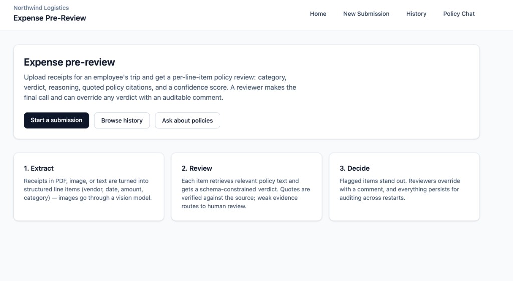
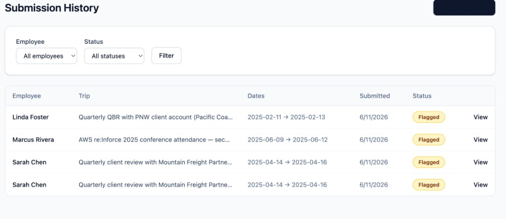
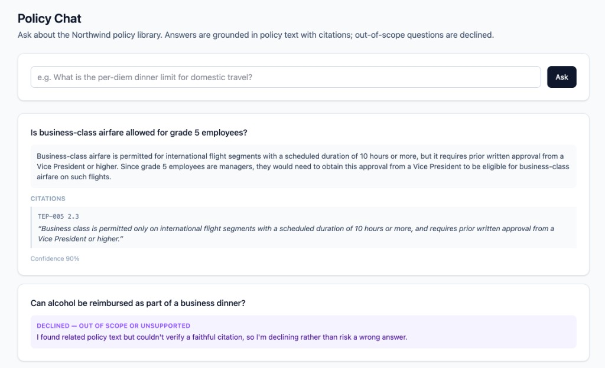
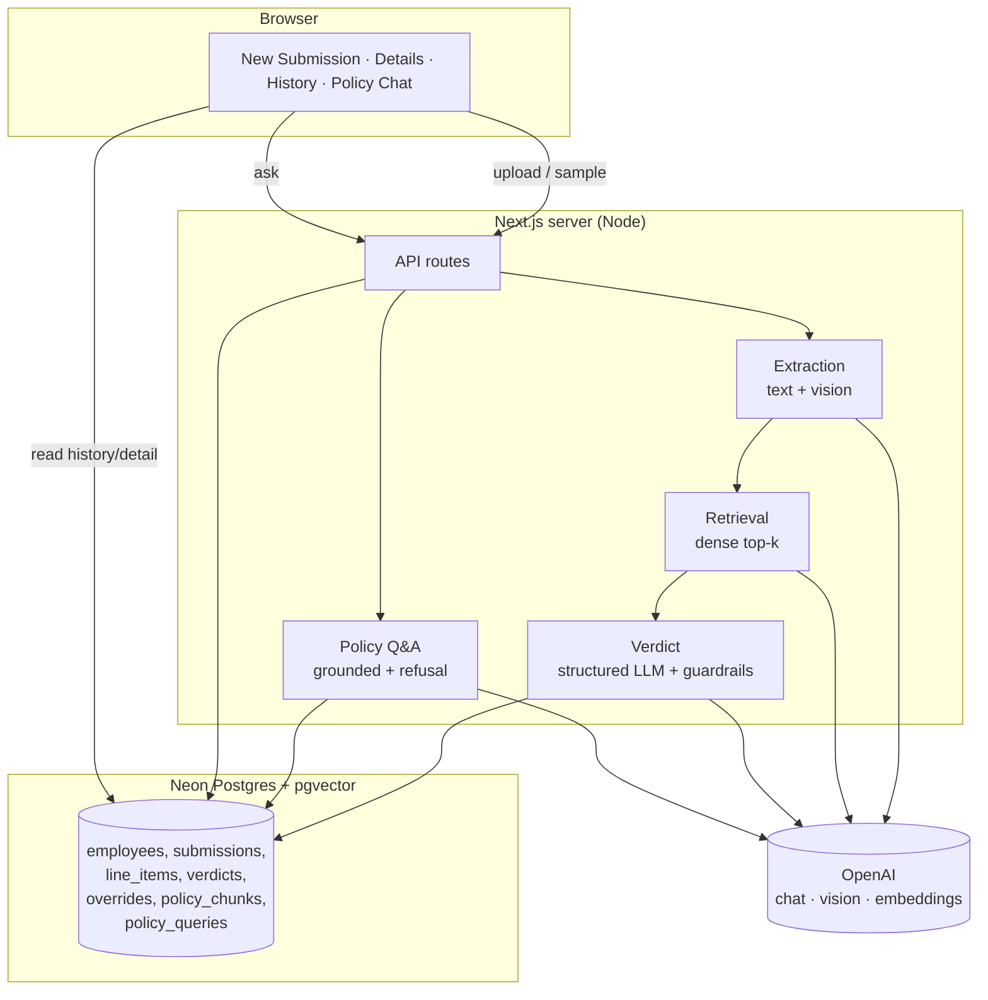

# Northwind Expense Pre-Review

An AI-assisted expense pre-review system for the Northwind Logistics case study. A finance reviewer
uploads receipts for an employee's trip; the system extracts each line item, checks it against the
company policy library, and returns a per-item verdict — **category, status, reasoning, quoted policy
citations, and a confidence score**. A human always makes the final call and can override any verdict
with an auditable comment. The system also answers ad-hoc policy questions with grounded citations and
declines questions outside the policy library.

URL: https://northwind-expense-review-production.up.railway.app/

---

## Table of contents

- [Screenshots](#screenshots)
- [Quick start (local)](#quick-start-local)
- [Required environment variables](#required-environment-variables)
- [Architecture](#architecture)
- [Data model](#data-model)
- [Receipt processing pipeline](#receipt-processing-pipeline)
- [Retrieval & citation guardrails](#retrieval--citation-guardrails)
- [Evaluation harness](#evaluation-harness)
- [Deployment (Railway)](#deployment-railway)
- [Cost per submission](#cost-per-submission)
- [Scaling to 10,000 submissions/day](#scaling-to-10000-submissionsday)
- [Known limitations](#known-limitations)
- [Next steps](#next-steps)

---

## Screenshots

**Home** — overview of the extract → review → decide flow.



**History** — browse past submissions, filter by employee and status; persists across restarts.



**Policy Chat** — grounded Q&A over the policy library with verified citations; out-of-scope questions are declined.



---

## Quick start (local)

**Prerequisites:** Node 20+ (developed on Node 24), a [Neon](https://neon.tech) Postgres database, and
an OpenAI API key.

```bash
# 1. Install dependencies
npm install

# 2. Configure environment
cp .env.example .env.local       # then fill in DATABASE_URL and OPENAI_API_KEY

# 3. Initialize the database: migrate (pgvector + tables), seed employees, ingest + embed policies
npm run db:setup

# 4. Run
npm run dev                      # http://localhost:3000
```

Verify everything is wired up at [`/api/health`](http://localhost:3000/api/health):

```json
{ "ok": true, "hasDatabase": true, "hasOpenAI": true, "policyChunkCount": 91, "employeeCount": 5 }
```

**Data layout** (already present in this repo):

- `policies/` — policy PDFs. `npm run db:ingest` chunks and embeds them.
- `submissions/` — the five sample submissions, each with `employee_info.json` + a `receipts/` folder.
  The five employees are seeded into the DB on setup (and lazily on first use), so they appear in the
  UI without uploading JSON. You can also one-click "Process" a sample's bundled receipts from the
  **New Submission** page.

### Scripts

| Command | Purpose |
|---|---|
| `npm run db:migrate` | Create the `vector` extension + all tables |
| `npm run db:seed` | Seed the five employees from `submissions/*/employee_info.json` |
| `npm run db:ingest` | Chunk + embed policy PDFs into `policy_chunks` |
| `npm run db:setup` | All three of the above, in order |
| `npm run dev` | Next.js dev server |
| `npm run build` / `npm run start` | Production build / long-running server |
| `npm run eval -- <expected.json>` | Run the evaluation harness |

---

## Required environment variables

| Variable | Required | Default | Notes |
|---|---|---|---|
| `DATABASE_URL` | Yes | — | Neon Postgres connection string (pgvector is enabled automatically by the migration) |
| `OPENAI_API_KEY` | Yes | — | Used for embeddings, extraction, verdicts, and policy Q&A |
| `OPENAI_CHAT_MODEL` | No | `gpt-4o-mini` | Model for extraction, verdicts, and Q&A |
| `OPENAI_VISION_MODEL` | No | `gpt-4o-mini` | Model for image-receipt extraction |

Env files are loaded by `scripts/load-env.ts` with `.env.local` taking precedence over `.env`.
Both are git-ignored.

---

## Architecture

A single **Next.js (App Router)** application — the same long-running Node server hosts the UI, the
API routes, and the synchronous processing pipeline. Persistence is **Neon Postgres + pgvector** via
**Drizzle ORM**. Models are OpenAI (`gpt-4o-mini` + `text-embedding-3-small`).



**Why this shape:**

- **One long-running server, synchronous processing.** Given the time box, a single Next server that
  processes a submission inline (with a spinner) avoids building a job queue and a worker tier. This is
  the right tradeoff at case-study scale; see [scaling](#scaling-to-10000-submissionsday) for what
  changes at 10k/day.
- **Postgres + pgvector, not a separate vector DB.** The corpus is ~100 pages. Keeping vectors,
  relational data, and audit history in one database means one connection string, transactional writes,
  and trivially-passing the "survives a restart" requirement. No second system to operate.
- **Schema-constrained LLM calls everywhere.** Extraction, verdicts, and Q&A all use OpenAI structured
  outputs (`zodResponseFormat`), so we never parse free-text. Invalid/missing structure degrades to a
  `needs_review` verdict rather than a crash.

Key directories:

```
src/
  app/                     # pages + API routes (App Router)
    api/                   # employees, samples, submissions, line-items/[id]/override, policy-chat, health
    submissions/new        # upload + sample picker
    submissions/[id]       # detail view with overrides
    history                # filterable list
    policy-chat            # grounded Q&A
  lib/
    extraction.ts          # receipt -> structured line item (text/vision/txt)
    retrieval.ts           # dense top-k over policy_chunks
    verdict.ts             # retrieval + structured verdict + guardrails
    citations.ts           # quote verification
    policy-qa.ts           # grounded answers + refusal
    process-submission.ts  # orchestration + status roll-up
    queries.ts             # server-side reads
    seed-employees.ts, samples.ts, ingest-policies.ts, embeddings.ts, db/
scripts/                   # migrate, seed, ingest, eval, load-env
```

---

## Data model

All tables live in Postgres (`src/lib/db/schema.ts`). UUID primary keys throughout.

| Table | Purpose | Notable columns |
|---|---|---|
| `employees` | The five seeded employees | `external_id` (e.g. `NW-04821`), `name`, `grade`, `manager`, `department` |
| `submissions` | One trip's review | `employee_id`, `trip_purpose`, `trip_start_date`, `trip_end_date`, `status` |
| `line_items` | One receipt = one line item | `vendor`, `expense_date`, `amount`, `currency`, `description`, `category_hint`, `extracted_raw` (JSONB) |
| `verdicts` | The system's per-item verdict (1:1 with line item) | `category`, `status`, `confidence`, `reasoning`, `citations` (JSONB), `needs_human_review` |
| `verdict_overrides` | Human overrides (append-only audit log) | `previous_status`, `new_status`, `comment` |
| `policy_documents` | One ingested policy file | `doc_id` (e.g. `TEP-005`), `filename`, `page_count` |
| `policy_chunks` | Embedded policy chunks | `doc_id`, `section`, `content`, `embedding vector(1536)` |
| `policy_queries` | Audit log of Q&A | `question`, `answer`, `citations`, `refused`, `confidence` |

**Status values:** `compliant`, `flagged`, `rejected`, `needs_review`. A submission's status is rolled
up from its line items (worst wins: rejected > flagged > needs_review > compliant).

**Effective status** of a line item = the latest override's `new_status` if any override exists,
otherwise the model verdict's status. Overrides are never destructive — they're appended, so the
original verdict and full override history remain visible and auditable.

---

## Receipt processing pipeline

For each receipt in a submission, processed sequentially (`src/lib/process-submission.ts`):

1. **Extract** (`extraction.ts`) → a structured line item `{ vendor, date, amount, currency, description, category_hint }`:
   - **Plain text** (`.txt`, unknown) → read bytes as UTF-8, extract with the chat model.
   - **PDF** → text via `pdf-parse`, then extract with the chat model.
   - **Image** (`.jpg`/`.png`/`.webp`) → sent as a base64 data URL to the **vision model**.
   - All three paths return the *same* schema via structured outputs.
2. **Retrieve** (`retrieval.ts`) → build a query from the item's category hint, description, vendor, and
   trip purpose; embed it; take the top-`k` (k = 6) policy chunks by cosine similarity.
3. **Verdict** (`verdict.ts`) → the chat model receives the employee/trip context, the extracted item,
   and the numbered policy excerpts, and returns a structured verdict. The prompt **only** allows
   citing the provided excerpts and requires verbatim quotes.
4. **Guardrails** → verify citations and handle weak retrieval (below).
5. **Persist** → write the `line_item`, its `verdict`, and update the submission's rolled-up status.

Trip context (employee grade, department, trip purpose, dates) is always injected into the verdict
prompt, because some policy limits depend on it — a receipt alone isn't enough to judge several items.

---

## Retrieval & citation guardrails

Three honesty mechanisms, all cheap and all directly tested by the brief:

1. **Quote verification** (`citations.ts`). Every citation the model returns is checked against the text
   of the chunks it was shown — a normalized substring match, with an 80-char prefix fallback for minor
   formatting drift. Citations that don't verify are dropped.

2. **Citation-failure routing.** If a verdict has **zero citations** or **any citation fails to verify**,
   the verdict is forced to `needs_review`, `needs_human_review = true`, and confidence is capped at
   **0.45**. This is what survives the "citation faithfulness" spot-check: the system will not present a
   confident verdict backed by a quote that isn't really in the policy.

3. **Weak-retrieval routing.** If the top chunk's similarity is below **0.35** (`WEAK_RETRIEVAL_THRESHOLD`),
   the item is routed to `needs_review` with capped confidence. For policy Q&A, weak retrieval is refused
   outright before spending a model call, and an answer whose citations all fail verification is downgraded
   to a refusal.

> **Honest caveat (important):** guardrail #2 is intentionally *strict* — it routes the **entire** verdict
> to `needs_review` whenever **any** cited quote fails verification, even if the model's underlying
> judgement was correct. In testing on a deliberately clean sample trip, this pushed several legitimate
> meal line items to `needs_review` (≈37.5% `needs_review` rate on that submission) because the model
> cited a real-but-not-retrieved clause (e.g. `TEP-002`) whose quote therefore couldn't be verified
> against the top-k chunks. This is a deliberate "prefer a human over a confident guess" tradeoff, but it
> currently over-triggers. The highest-leverage fix is in [next steps](#next-steps): prune only the
> unverified citations instead of the whole verdict, and raise retrieval recall.

---

## Evaluation harness

A self-contained script (`scripts/eval.ts`) that reads a JSON file of expected outcomes, compares it
against what the system stored in the DB, and runs the live policy-chat pipeline for Q&A tests.

```bash
npm run eval -- eval/expected.example.json
```

It needs only `DATABASE_URL` + `OPENAI_API_KEY` (it imports the libs directly; no running server
required). Process the submissions you want to grade first (via the UI), then run the harness.

**Expected-outcomes format** — every field except identifiers is optional, so you specify only the
signals you care about. See [`eval/expected.example.json`](eval/expected.example.json):

```jsonc
{
  "submissions": [
    {
      // identify a stored submission by id, OR by employee external id
      // (in which case the most recent submission for that employee is used)
      "employeeExternalId": "NW-04821",
      "expectedStatus": "flagged",                       // optional rollup
      "lineItems": [
        {
          "receiptFilename": "01_united_airlines.pdf",   // matched by filename
          "expectedStatus": "compliant",
          "expectedCategory": "airfare",                 // optional
          "expectedCitationDocIds": ["TEP-005"]          // optional, any-overlap
        }
      ]
    }
  ],
  "policyChat": [
    { "question": "What is the capital of France?", "expectRefusal": true },
    { "question": "Domestic flight class?", "expectRefusal": false, "expectCitationDocIds": ["TEP-005"] }
  ]
}
```

**Metrics reported:**

| Metric | Meaning |
|---|---|
| Verdict accuracy | stored verdict status == `expectedStatus` |
| Category accuracy | stored category == `expectedCategory` (when provided) |
| Citation doc match | stored citations overlap `expectedCitationDocIds` (when provided) |
| `needs_review` rate | share of stored line items the system punted on |
| Citation verification rate | share of stored quotes that actually appear in the cited document's text |
| Policy-chat refusal acc. | `refused == expectRefusal` |
| Policy-chat citation acc. | answered tests cite an expected doc |

Metrics are evaluated against the **model verdict**, not human overrides, so they reflect the system's
own output. Citation verification re-checks quotes against the **full** policy document text (not just
the top-k that were retrieved at verdict time), so it's a faithfulness measure independent of retrieval.

Example output (against the sample Denver submission):

```
Verdict accuracy           : 5/5 (100.0%)
Category accuracy          : 5/5 (100.0%)
Citation doc match         : 1/1 (100.0%)
needs_review rate          : 3/8 (37.5%)
Citation verification rate : 9/9 (100.0%)
Policy-chat refusal acc.   : 2/2 (100.0%)
Policy-chat citation acc.  : 1/1 (100.0%)
```

---

## Deployment (Railway)

The app is a long-running Node server (Next.js `start`), which suits Railway directly — no serverless
adaptation needed. Build/start/healthcheck are committed in [`railway.json`](railway.json), so Railway
picks them up automatically.

**Steps:**

1. Push this repo to GitHub.
2. In Railway: **New Project → Deploy from GitHub repo**, select this repo. Leave the **Root Directory**
   empty (the app is at the repo root). Railway auto-detects Nixpacks.
3. Add **Variables** (Service → Variables):
   - `DATABASE_URL` — your Neon connection string (with `?sslmode=require`)
   - `OPENAI_API_KEY`
   - *(optional)* `OPENAI_CHAT_MODEL`, `OPENAI_VISION_MODEL` (default `gpt-4o-mini`)
   - **Do not set `PORT`** (Railway injects it; the server binds to it via `next start -H 0.0.0.0`).
   - **Do not set `NODE_ENV=production`** manually — it makes the build skip devDependencies (TypeScript,
     Tailwind) and fail. Railway applies production at runtime on its own.
4. Under **Settings → Networking**, click **Generate Domain** to get a public URL.
5. **One-time database setup** — only needed for a *fresh* database. If you point at the same Neon DB you
   used locally (already migrated/seeded/ingested), skip this. Otherwise run once against the prod DB:

   ```bash
   DATABASE_URL="<prod-url>" OPENAI_API_KEY="<key>" npm run db:setup
   ```

   (Run it locally pointing at the prod `DATABASE_URL`, or as a Railway one-off command.)

**Settings summary:**

| Setting | Value |
|---|---|
| Builder | Nixpacks (auto) |
| Build command | `npm run build` (from `railway.json`) |
| Start command | `npm run start` → `next start -H 0.0.0.0` (from `railway.json`) |
| Healthcheck path | `/api/health` (from `railway.json`) |
| Node version | 22 (pinned via `.nvmrc` + `engines`) |
| Required vars | `DATABASE_URL`, `OPENAI_API_KEY` |

Healthcheck passes only when the server can reach the database, so a misconfigured `DATABASE_URL` fails
the deploy fast rather than going live broken.

---

## Cost per submission

Models: `gpt-4o-mini` ($0.15 / 1M input, $0.60 / 1M output tokens) and `text-embedding-3-small`
($0.02 / 1M tokens). Each receipt costs **one embedding** (retrieval query) + **one extraction call** +
**one verdict call**.

Rough per-receipt token budget:

| Call | Input tokens | Output tokens | Approx cost |
|---|---:|---:|---:|
| Extraction (text) | ~1,700 | ~80 | ~$0.0003 |
| Retrieval embedding | ~50 | — | ~$0.000001 |
| Verdict (system + trip + item + 6 excerpts) | ~1,800 | ~250 | ~$0.0004 |
| **Per receipt** | | | **~$0.0007** |

A typical submission of 6–8 receipts costs roughly **$0.005–$0.008** (about half a cent to a cent).
Image receipts cost a bit more because vision adds image tokens (a receipt photo is roughly
1k–2.5k extra input tokens), pushing an all-image submission toward ~$0.01–$0.02. One-time policy
ingestion (~91 chunks) is negligible (well under one cent).

These are order-of-magnitude estimates; actual usage depends on receipt length and image resolution.

---

## Scaling to 10,000 submissions/day

10k submissions/day ≈ **60k–80k receipts/day** ≈ ~180k–240k OpenAI calls/day. Model cost lands around
**$50–$100/day** (~$1.5k–$3k/month) at current `gpt-4o-mini` pricing — cheap relative to the manual
review it replaces. The real work is throughput and reliability, not cost:

1. **Async processing.** Replace the synchronous request with: upload → enqueue (SQS / a Postgres-backed
   queue like pgmq / Redis) → a pool of stateless workers processes receipts → status updates surfaced to
   the UI via polling or websockets. This removes per-request timeout limits and lets us scale workers
   horizontally.
2. **Concurrency + rate limits.** Process receipts within a submission in parallel, add exponential
   backoff + retry on 429s, batch embedding calls, and (if needed) shard across multiple API keys / a
   higher OpenAI tier.
3. **An ANN index on `policy_chunks`.** At ~100 pages a sequential scan is fine; at scale add an HNSW
   index (`vector_cosine_ops`) so retrieval stays sub-10ms as the corpus grows. (The IVFFlat index was
   intentionally omitted for the case study because it can't be built on an empty table.)
4. **Caching & dedup.** Cache policy-chunk embeddings (already one-time), and hash receipts to skip
   re-processing duplicates. Cache common policy-chat answers.
5. **Connection management.** Use Neon's pooled endpoint / PgBouncer for the worker fleet; the serverless
   HTTP driver used here is fine for a single server but a worker pool wants pooled connections.
6. **Observability & cost controls.** Per-submission cost/latency metrics, token budgets, dead-letter
   queue for receipts that repeatedly fail extraction, and alerting on the `needs_review` rate (a spike
   usually means retrieval or extraction regressed).

The data model and pipeline stages don't need to change — only the execution substrate (sync → queued
workers) and the retrieval index.

---

## Known limitations

- **Strict citation guardrail over-triggers.** As described above, any single unverifiable quote routes
  the whole verdict to `needs_review`, so some legitimately-compliant items (notably meals citing a
  not-retrieved clause) are punted to a human. Honest, but currently too aggressive.
- **Plain dense top-k retrieval.** No hybrid (keyword + vector) search, no reranker, and **no
  cross-reference following** — a chunk that says "see TEP-002 §2.3" won't automatically pull in
  TEP-002. For ~100 pages this is acceptable, but it's the main retrieval-recall gap.
- **No OCR fallback for scanned PDFs.** PDFs go through `pdf-parse` (text layer). A scanned/image-only
  PDF yields little text and isn't re-rendered to an image for the vision model, so it will likely land
  in `needs_review`. Image *files* (jpg/png/webp) are handled directly by the vision model.
- **Single model tier.** Everything uses `gpt-4o-mini`. There's no escalation to a stronger model for
  low-confidence or high-dollar items.
- **Quote check is substring matching, not entailment.** It confirms the quote exists in the policy, not
  that the quote actually supports the verdict's logic.
- **Synchronous processing.** Fine at case-study scale; a large submission ties up a request for tens of
  seconds (≈5s/receipt). Mitigations are in the scaling section.
- **Sequential receipt processing.** Receipts are processed one at a time for simplicity, not in parallel.

---


